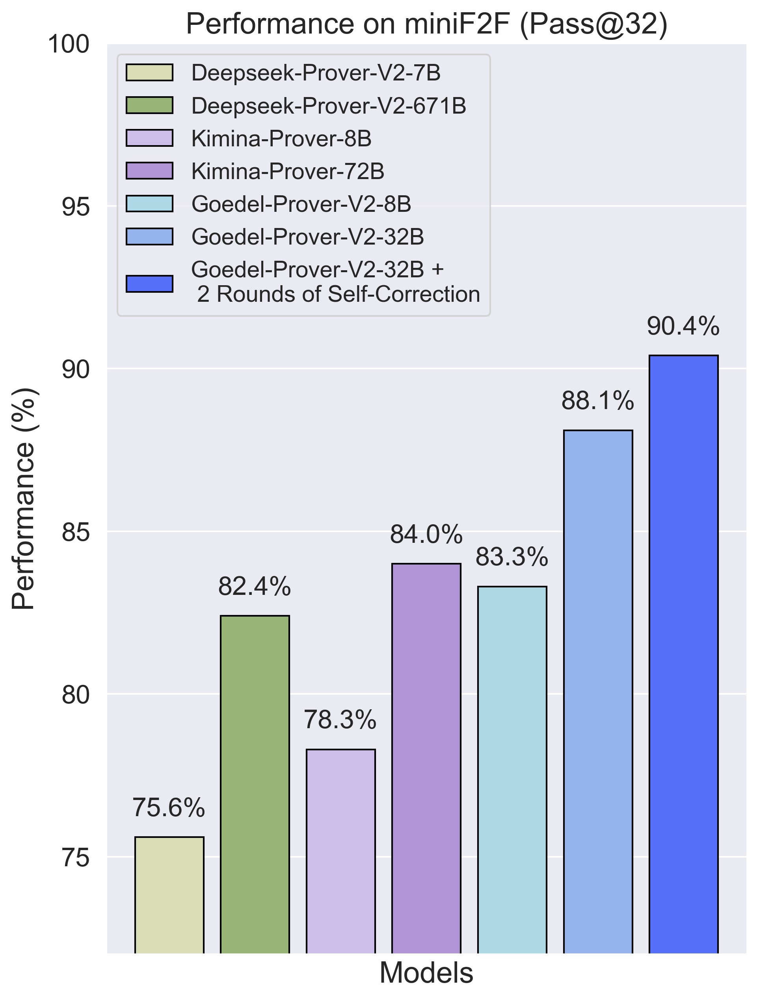
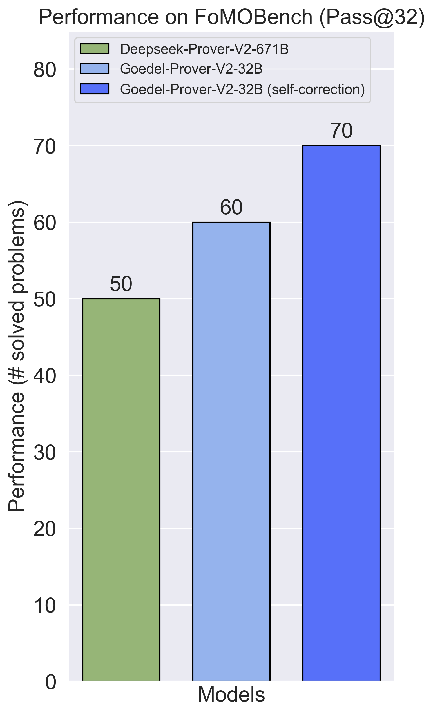
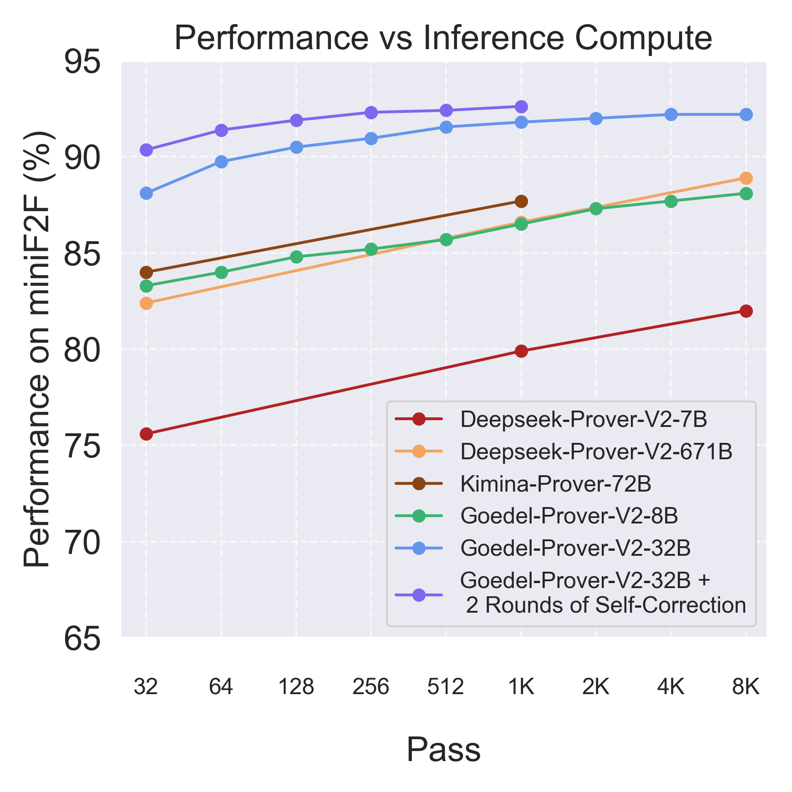
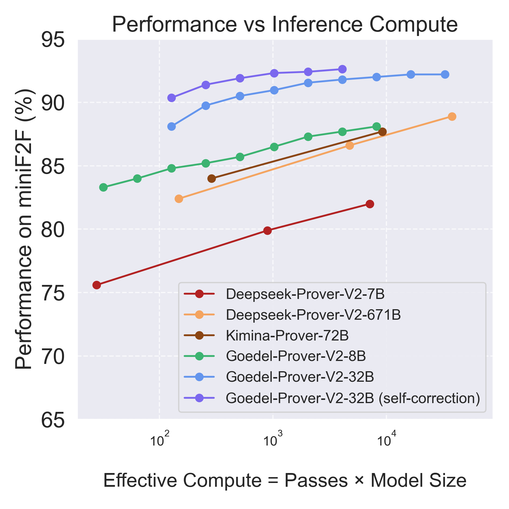

# Goedel-Prover-V2


## 1. Introduction

We introduce Goedel-Prover-V2, an open-source language model series that achieves state-of-the-art performance in automated formal proof generation. Based on the standard expert iteration and reinforcement learning pipeline, we implemented the following novel methodology: (1) scaffolding data synthesis, which creates and augments intermediate problems to bridge the gap between simple and difficult proofs; (2) compiler-guided self-correction, where the model is trained to iteratively correct its own proofs using lean compiler feedback, mimicking human problem-solving; and (3) model averaging, which restores diversity and improves overall Pass@K performance for large K. Our small model, Goedel-Prover-V2-8B, reaches 83.0% on MiniF2F test set under 32 sample budget, outperforming DeepSeek-Prover-V2-671B while being much smaller. Our flagship model, Goedel-Prover-V2-32B, achieves 88.0% on MiniF2F under 32 sample budget, outperforming Kimina-Prover-70B by 4 percentage points under the same sample budget, and 90.4% with additional two rounds of self-correction per sample. Additionaly, Geodel-Prover-V2-32B solves xx problems on PutnamBench with 32 sample budget and 2 rounds of self-correction per sample, securing the 1st on the leaderboard.

## 2. Key Achievements

### State-of-the-art performance on multiple benchmarks under Pass@32.


|  |  |  |
|:--:|:--:|:--:|


*<p align="center"> <b>Figure 1</b>: Pass@32 performance of Goedel-Prover-V2 and other baselines on MiniF2F, PutnamBench, and our curated FoMOBench.  
<b>(Left)</b> Our small model, Geodel-Prover-V2-8B, achieves 83.0% on MiniF2F test set under Pass@32, outperforming DeepSeek-Prover-V2-671B under same sample budget. Our flagship model Goedel-Prover-V2-32B achieves 88.0%, outperforming both previous SOTA DeepSeek-Prover-V2-671B and the concurrent work Kimina-Prover-72B under Pass@32. Additional 2 rounds of compiler-guided self-correction push the score to 90.4%.  
<b>(Middle)</b> On PutnamBench, our small model (8B) and flagship model (32B) solves 15 and 43 problems under 32 sample budget, significantly outperforming 23 problems solved by DeepSeek-Prover-V2-671B under the same sample budget. 2 rounds of self-correction push the score to xxx.  
<b>(Right)</b> On our newly curated Olympiad benchmark <b>FoMOBench</b> (<b>Fo</b>rmal <b>M</b>ath <b>O</b>lympiad), which consists of 360 math olympiad problems from IMO, IMO shortlist, and regional mathematical Olympiad problems, Goedel-Prover-V2-32B successfully solved 60 problems out of 360 (Pass@32), surpassing DeepSeek-Prover-V2-671B which solves 50 under the same sample budget.</p>*

### Rank 1 on PutnamBench Leaderboard

<div align="center">
  <table style="margin: 0 auto;">
    <thead>
      <tr>
        <th>#</th>
        <th>Model</th>
        <th>num‑solved</th>
        <th>compute</th>
      </tr>
    </thead>
    <tbody>
      <tr><td>1</td><td>Goedel-Prover-V2-32B</td><td>xxx</td><td>pass@32+2 rounds self-correction</td></tr>
      <tr><td>2</td><td>DeepSeek‑Prover‑V2-671B</td><td>47</td><td>pass@1024</td></tr>
      <tr><td>3</td><td>DSP+</td><td>23</td><td>pass@128</td></tr>
      <tr><td>4</td><td>Kimina‑Prover‑7B‑Distill</td><td>10</td><td>pass@192</td></tr>
    </tbody>
  </table>
    <!-- table caption -->
    <caption align="bottom"><strong>Table 2</strong>: <em>PutnamBench leaderboard of different models. Goedel-Prover-V2-32B successfully solves xxx problems out of 658 from PutnamBench, under 32 sample budget and 2 rounds of self-correction per generated proof. Goedel-Prover-V2-32B ourperforms existing models on the leaderboard and ranked 1.</em></caption>
</div>

### Compelling scaling performance under different budgets.


|  |  |
|:--:|:--:|


*<p align="center"> <b>Figure 3</b>: Performance on MiniF2F test set under different sample/compute budget. For effective compute, model size is measured in number of parameters (active parameters for MoE model), normalized by 8B.  
<b>(Left)</b> Performance of different models under different sample budget. Our Goedel-Prover-V2-32B outperforms previous models on all sample budget up to 8K. With self-correction the performance is even better. (The tokens for self-correction is much less compared with first round full-proof generation.) Our 8B model has similar scaling curve compared with DeepSeek-Prover-V2-671B, where the performance is slightly better on small passes while little worse on large passes.  
<b>(Right)</b> Performance of different models under different effective compute budget. When taking the number of activated model parameters into account, our 8B model has better performance compared with Kimina-Prover-72B and DeepSeek-Prover-V2-671B. </p>*


## 3 Model & Dataset Downloads

We release Goedel-Prover-V2 in two model sizes: 8B and 32B parameters, which are trained on top of Qwen3-8B and Qwen3-32B respectively. We also release FoMOBench, which serves as a benchmark more close to the International Mathematics Olympiad (IMO).

<div align="center">
  
| Model | Download |
| -------- | -------- |
|    Goedel-Prover-V2-32B    |   [🤗Download](https://huggingface.co/Goedel-LM/Goedel-Prover-V2-32B)    |
|    Goedel-Prover-V2-8B    |   [🤗Download](https://huggingface.co/Goedel-LM/Goedel-Prover-V2-8B)    |

</div>

<div align="center">

| Dataset | Download |
| -------- | -------- |
|    FoMOBench    |   [🤗Download](https://huggingface.co/datasets/Goedel-LM/FoMOBench)    |

</div>

## 4. Quick Start
You can directly use [Huggingface's Transformers](https://github.com/huggingface/transformers) for model inference.

```
from transformers import AutoModelForCausalLM, AutoTokenizer
import torch
torch.manual_seed(30)

model_id = "Goedel-LM/Goedel-Prover-V2-32B"
tokenizer = AutoTokenizer.from_pretrained(model_id)
model = AutoModelForCausalLM.from_pretrained(model_id, device_map="auto", torch_dtype=torch.bfloat16, trust_remote_code=True)


formal_statement = """
import Mathlib
import Aesop

set_option maxHeartbeats 0

open BigOperators Real Nat Topology Rat


theorem square_equation_solution {x y : ℝ} (h : x^2 + y^2 = 2*x - 4*y - 5) : x + y = -1 := by
  sorry
""".strip()

prompt = """
Complete the following Lean 4 code:

```lean4
{}```

Before producing the Lean 4 code to formally prove the given theorem, provide a detailed proof plan outlining the main proof steps and strategies.
The plan should highlight key ideas, intermediate lemmas, and proof structures that will guide the construction of the final formal proof.
""".strip()

chat = [
  {"role": "user", "content": prompt.format(formal_statement)},
]

inputs = tokenizer.apply_chat_template(chat, tokenize=True, add_generation_prompt=True, return_tensors="pt").to(model.device)

import time
start = time.time()
outputs = model.generate(inputs, max_new_tokens=32768)
print(tokenizer.batch_decode(outputs))
print(time.time() - start)
```

## 5. Batch Inference and Self-correction

Codes coming soon.


### 6. Cite
```
paper
```
